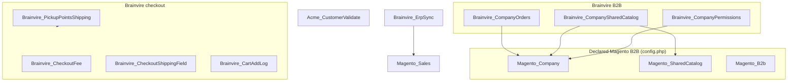
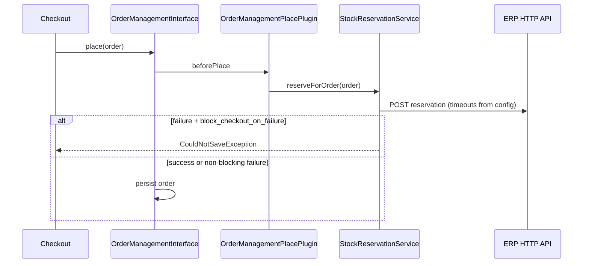
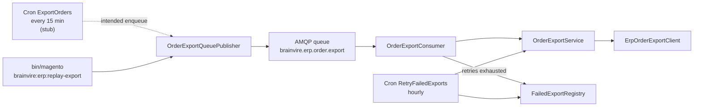
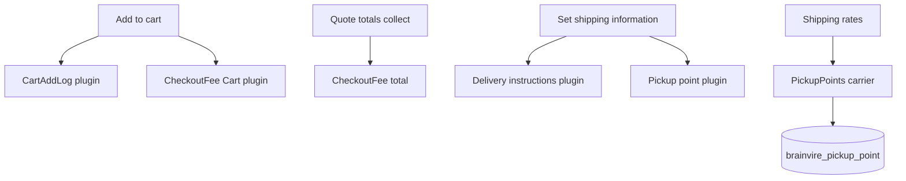

# Architecture — Acme Cloud-shaped Commerce (eval fixture)

verified: 2026-09-22

This document describes the **synthetic** Adobe Commerce Cloud-shaped fixture under `evals/fixtures/cloud-shaped`. It is not a full Magento installation: core/vendor, `pub/`, and Cloud service wiring are omitted on purpose. Custom behavior lives in `app/code/`, storefront overrides in `app/design/`, and a minimal module enablement list in `app/etc/config.php`.

---

## Platform and stack

| Signal | Value | Evidence |
|--------|--------|----------|
| Platform model | Adobe Commerce on Cloud (PaaS) **shape** | `.magento.app.yaml` (`type: php:8.2`, synthetic marker comment) |
| Product | Enterprise Edition | `composer.json` → `magento/product-enterprise-edition: 2.4.7-p3` |
| PHP | ^8.2 | `composer.json` |
| B2B core (declared enabled) | Company, Shared Catalog, B2B | `app/etc/config.php` |
| Headless / Hyva / EDS | Not present in this fixture | No `hyva-themes/`, no EDS `blocks/` tree in this root |

**Operational note:** Running this tree as-is requires a full Commerce install that merges this `app/` overlay; the fixture alone is for skill evals and static analysis.

---

## Repository layout

```
cloud-shaped/
├── .magento.app.yaml          # Cloud PaaS marker (minimal)
├── composer.json              # EE 2.4.7-p3 requirement (no lock in fixture)
├── README.md                  # ErpSync module overview
├── app/
│   ├── etc/config.php         # Enabled modules (subset)
│   ├── code/
│   │   ├── Acme/              # Customer validation helper
│   │   └── Brainvire/         # ERP, B2B, checkout extensions
│   └── design/frontend/Acme/default/   # Theme overrides (checkout, catalog, theme)
└── docs/
    ├── ARCHITECTURE.md        # This file
    ├── adr/001-*.md           # ERP export async decision
    └── ai/project-facts.md    # Durable facts for agents (human-reviewed)
```

---

## Module map

### Enablement (`app/etc/config.php`)

| Module | Role |
|--------|------|
| `Magento_Store`, `Magento_Company`, `Magento_SharedCatalog`, `Magento_B2b` | Declared core B2B stack (stubs in fixture) |
| `Acme_CustomerValidate` | Email validation utility + data patch |
| `Brainvire_ErpSync` | ERP stock reservation + async order export |
| `Brainvire_CompanyOrders` | Company-scoped order history on storefront |
| `Brainvire_CompanySharedCatalog` | CLI helpers to assign SKUs to company shared catalogs |
| `Brainvire_CheckoutShippingField` | Delivery instructions on quote/order address |
| `Brainvire_CartAddLog` | Logging on add-to-cart |
| `Brainvire_CheckoutFee` | Flat checkout fee total + UI |
| `Brainvire_PickupPointsShipping` | Custom carrier + pickup point master data |

**Present in code but not in `config.php`:** `Brainvire_CompanyPermissions` (see [B2B](#b2b-company--shared-catalog)).

### Dependency overview



---

## External integration: ERP (`Brainvire_ErpSync`)

Architectural split (see [ADR-001](./adr/001-erp-order-export-queue-cron-not-place-order-sync.md)):

1. **Synchronous, bounded** — ERP **stock reservation** on the place-order path.
2. **Asynchronous, durable** — full **order export** via message queue, cron enqueue/retry, and CLI replay.

### Place order (synchronous stock)



- **Wiring:** plugin on `Magento\Sales\Api\OrderManagementInterface` in `Brainvire/ErpSync/etc/di.xml`.
- **Config:** `brainvire_erp/stock_reservation/*` in `etc/config.xml` (enabled by default, short connect/read timeouts, can block checkout on failure).
- **Client:** `Model/Api/ErpStockReservationClient.php`.
- **Dead / unused in fixture:** `Observer/ReserveStockOnOrderSubmit.php` exists but `etc/events.xml` is empty (no observer registration).

### Order export (async)



| Component | Responsibility |
|-----------|----------------|
| Topic / queue | `brainvire.erp.order.export` (`communication.xml`, `queue_topology.xml`, `queue_consumer.xml`, AMQP connection) |
| Message | JSON string with `order_id` |
| `OrderExportService` | Load order, build payload (`idempotency_key`, totals, currency), call export client inside `RetryExecutor` |
| `RetryExecutor` | Exponential backoff; retryable vs permanent exceptions |
| `FailedExportRegistry` | `FlagManager` JSON list for cron retry after consumer exhausts retries |
| `ExportOrders` cron | **Fixture stub** — no enqueue logic yet (`README.md`) |
| `ReplayOrderExportCommand` | Manual re-publish to queue |

**Export payload (current contract):** documented in root `README.md`.

**Config paths:** `brainvire_erp/order_export/*` (sandbox URL, attempts, delays, cURL timeouts).

---

## B2B: company and shared catalog

### Order visibility (`Brainvire_CompanyOrders`)

- **Plugin:** `aroundGetOrders` on `Magento\Sales\Block\Order\History`.
- **Logic:** `BuyerOrderLoader` uses `Magento\Company` APIs:
  - Filter orders by company via `company_order` collection.
  - If the user lacks `Magento_Sales::view_all_company_orders`, further restrict to their own `customer_id`.

Fixes a fixture narrative where store-only filtering leaked other companies’ orders on shared websites.

### Shared catalog operations (`Brainvire_CompanySharedCatalog`)

- **No storefront plugins** — operational CLI only (`etc/di.xml` registers commands).
- **Services:** `SharedCatalogProductAssigner`, `CompanyProductPricingAssigner` — assign SKU to the shared catalog linked to a company, optional custom price via Shared Catalog APIs.

### Company-wide collection guard (`Brainvire_CompanyPermissions`)

- **Intent:** `CompanyScopeApplier` joins `company_order` on any frontend `sales_order` collection load so buyers only see their company’s rows.
- **Gap in fixture:** `Plugin/Sales/Model/ResourceModel/Order/CollectionPlugin.php` is implemented, but `etc/di.xml` is **empty** and the module is **not** listed in `app/etc/config.php`. Code is present for eval/review scenarios; it is not active in the shipped enablement list.

---

## Checkout and cart

| Module | Extension mechanism | Behavior |
|--------|---------------------|----------|
| `Brainvire_CheckoutFee` | Quote total collector (`etc/sales.xml`), Knockout summary UI, plugin on `Cart` | Configurable flat fee added during totals collection |
| `Brainvire_CheckoutShippingField` | DB column on `quote_address`, extension attributes, plugin on `ShippingInformationManagement`, checkout UI components | Persists delivery instructions (`bv_delivery_instructions`) |
| `Brainvire_PickupPointsShipping` | Custom shipping carrier, `brainvire_pickup_point` table, quote/order address columns, shipping plugins | One rate method per active pickup point; selection stored on addresses |
| `Brainvire_CartAddLog` | Plugin on `Magento\Checkout\Model\Cart` | Logs add-to-cart actions (observability fixture) |

**Checkout plugin ordering:** `CheckoutShippingField` (sortOrder 10) and `PickupPointsShipping` (sortOrder 20) both plug `ShippingInformationManagement` — pickup runs after delivery instructions save.



---

## Storefront theme (`Acme/default`)

Parent theme is not declared in this minimal tree; overrides target standard module paths:

| Area | Path | Notes |
|------|------|--------|
| Checkout | `Magento_Checkout/templates/button.phtml`, `success.phtml` | Custom place-order button; `dataLayer` `begin_checkout` + GTM fixture snippet via secure renderer |
| Catalog / Theme | `Magento_Catalog`, `Magento_Theme` `_extend.less` | Style extensions |

Classic Luma/Knockout checkout patterns (`CheckoutFee` and `CheckoutShippingField` use RequireJS mixins and checkout layout XML).

---

## Acme_CustomerValidate

- **`Model/Validator`:** wraps Magento’s `EmailAddress` validator for reusable email checks.
- **Setup patch:** `SetEmailValidationStatusDefault.php` — data fixture for customer email validation status (module scaffolding for validation evals).

No plugins or frontend wiring in the current file set; consumed by other code or tests outside this slice.

---

## Cross-cutting concerns

| Concern | How this fixture handles it |
|---------|------------------------------|
| **Idempotency** | Export uses `magento-order-{increment_id}` keys in HTTP payloads |
| **Failure modes** | `ExportRetryableException` vs `ExportPermanentFailureException`; consumer vs cron retry |
| **Secrets / URLs** | ERP endpoints empty by default — must be configured per environment (never commit secrets) |
| **Queues & cron** | Export path assumes AMQP consumer `brainvire.erp.order.export` and cron groups in `crontab.xml` |
| **Agent onboarding** | Durable business rules in `docs/ai/project-facts.md` (e.g. ERP as stock source of truth on place order) |

---

## Known gaps and fixture stubs

1. **`Cron/ExportOrders`** — scheduled every 15 minutes but empty body; pending-order enqueue not implemented.
2. **`Brainvire_CompanyPermissions`** — not enabled in `config.php`; DI plugin not declared.
3. **`ReserveStockOnOrderSubmit` observer** — class exists; not bound in `events.xml` (place-order plugin is the active path).
4. **Partial Commerce root** — no `vendor/`, indexers, or full config merge; module list in `config.php` is illustrative.

---

## Related documents

- [README.md](../README.md) — ErpSync flow and configuration table
- [ADR-001: ERP order export via queue](./adr/001-erp-order-export-queue-cron-not-place-order-sync.md)
- [docs/ai/project-facts.md](./ai/project-facts.md) — human-reviewed facts for AI assistants
